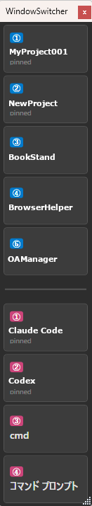

# WindowSwitcher

複数の VS Code / Windows Terminal ウィンドウをすばやく切り替えるための常駐型 WPF アプリ。

複数案件を並行作業していると、大量の VS Code と Terminal が開きっぱなしになりがち。タスクバーだけでは目的のウィンドウを探すのが煩雑なので、専用の一覧パネルから一発で切り替えられるようにしたもの。

## スクリーンショット



## 機能

- **VS Code 一覧** — 起動中の VS Code ウィンドウをワークスペース名で一覧表示
- **Windows Terminal 一覧** — 起動中の Terminal ウィンドウを一覧表示（セパレーターで区切り）
- **クリックで切り替え** — 一覧のアイテムをクリックするとそのウィンドウがフォアグラウンドに
- **キーボードショートカット**
  - `Ctrl+Alt+1~9` — VS Code を番号で切り替え
  - `Ctrl+Shift+1~9` — Terminal を番号で切り替え
- **ピン止め** — 右クリックで Pin/Unpin。ピン止めしたアイテムは常に上部に固定表示（未起動時はグレー）
- **安定した並び順** — アクティブウィンドウの切り替えで順番が変わらない。新規は末尾追加、終了したら詰める
- **ウィンドウ位置の記憶** — サイズと位置を `settings.json` に保存し、次回起動時に復元
- **常時最前面** — TopMost + ToolWindow スタイル（タスクバーに出ない）

## 技術的な仕組み

- **VS Code の識別**: `EnumWindows` で全ウィンドウを列挙 → プロセス名 `Code.exe` でフィルタ → タイトルの `<file> - <workspace> - Visual Studio Code` パターンからワークスペース名を抽出
- **Terminal の識別**: ウィンドウクラス `CASCADIA_HOSTING_WINDOW_CLASS`（Windows Terminal 固有）でフィルタ
- **ウィンドウ切り替え**: `AttachThreadInput` + `BringWindowToTop` + `SetForegroundWindow` で確実にアクティブ化
- **短縮名**: `devsys-BucketCounter` → `BucketCounter`（ハイフン以降を表示）

## 動作環境

- Windows 10/11
- .NET 10
- Windows Terminal（Terminal 一覧機能を使う場合）

## ビルド・実行

```bash
cd WindowSwitcher
dotnet build
dotnet run
```

## 設定ファイル

実行ファイルと同じディレクトリに `settings.json` が作成されます。

```json
{
  "PinnedNames": ["Tsugumi", "diva-msgraph-cli"],
  "PinnedTerminalNames": ["BucketCounter"],
  "WindowLeft": 0,
  "WindowTop": 100,
  "WindowWidth": 160,
  "WindowHeight": 600
}
```

## ライセンス

MIT
